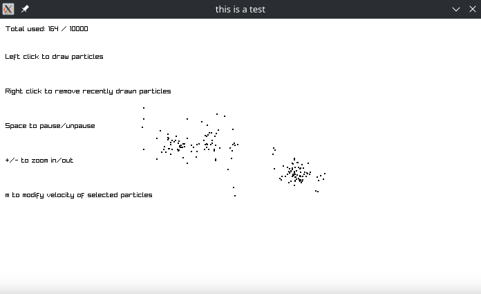

This is a gravity simulation

It simulates a bunch of particles interacting via basic newtonian gravity

F = Gm1m2/r^2

Dependency (just 1):
Raylib

Includes a basic gui, able to pause/unpause, add/remove particles, modify sections of particles' velocity

